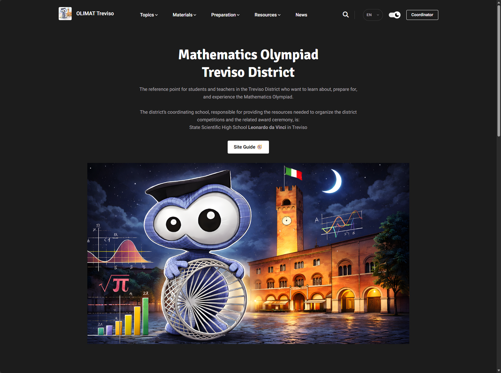

I was asked to build a website for **OLIMAT Treviso**, the Treviso district of the Italian Math Olympiad.

It was a project I was happy to work on for reasons that go a little beyond building the website itself. I participated in math competitions when I was in high school, and the [Liceo Scientifico Leonardo da Vinci](https://www.liceodavinci.edu.it/) (my former high school) is also the school referenced by the project as the hub for the Treviso district.

I still have a certain attachment to this kind of mathematics and to the environment around the competitions, so working on something connected to it again was nice.

The website is available at [olimat-tv.it](https://www.olimat-tv.it/), and the source is public on [🛠️ GitHub](https://github.com/OLIMAT-Treviso/OLIMAT-Treviso.github.io).

## What the website is for

The site is mainly intended for students and teachers in the Treviso district who are interested in the Math Olympiad.

There is quite a lot of material available online for olympiad mathematics, but when you are starting out it is not necessarily obvious what to study, where to find good material, or even how the different stages of the competition work.

The website puts this information in one place.

There are pages explaining the competition itself, how the district selection works and how students can progress from the school-level competitions through the district and national stages.

The rest of the site is more focused on preparation. It collects mathematical topics, material produced by teachers, information about training activities and links to other useful resources.

I wanted the navigation to stay fairly simple because a student arriving on the site should be able to find either an explanation of how the competitions work or something useful to study without having to understand the structure of the project first.




## Technical side

I used **Hugo** to build the site.

For this type of website I find Hugo very convenient. Most changes are content changes rather than application changes, so having the pages stored as Markdown makes maintenance straightforward.

Adding a new resource, updating a competition page or publishing a piece of news generally means editing a Markdown file rather than touching the layout or application code.

The site uses **Hugoplate** as its starting theme, with additional styling and modifications on top of it. The styling is based around **Tailwind CSS**, while Hugo handles the content structure, templates and generation of the final static site.

The content is separated into sections such as topics, preparation material, resources, news and authors. Italian and English versions are maintained separately, with Hugo handling the language structure and navigation between them.

I also kept features that are useful once the amount of material starts growing, particularly site-wide search and the light/dark theme.

The repository contains both the content and the site configuration, and deployment is handled automatically through **GitHub Actions**. A push to the main branch builds the production version of the Hugo site and publishes the generated static files to **GitHub Pages**.

```text
Markdown content
      ├── Italian/English
      ▼
Hugo + templates
      ├── Tailwind CSS
      ├── static assets
      ▼
GitHub Actions
      │
      ▼
GitHub Pages
```

One of the main reasons I chose this setup is that it does not make future expansion particularly complicated.

If another mathematical topic, resource collection, training activity or section is needed later, it can normally be added within the existing content structure. The technical side does not need to change every time the site grows.

## Organising the mathematics

The mathematical content needed a different kind of organisation from a normal blog.

Someone preparing for olympiad mathematics is usually not looking for articles in chronological order. They are more likely to arrive with a question such as *“What should I study?”*, *“Where can I learn number theory?”* or *“What kind of problems should I practise?”*

The main mathematical section is therefore divided into the areas that appear most often in competitions:

* **Algebra**
* **Number theory**
* **Geometry**
* **Combinatorics and probability**
* **Techniques and topics that apply across several areas**

There is also a syllabus page that gives students a broader idea of the mathematics they are likely to encounter at the different stages of the Olympiad.

The individual topic pages then go further by collecting the relevant subtopics and pointing towards books, notes, lessons and other material that can be used to study them.

A separate **Materials** section collects notes and exercises produced by teachers and used during olympiad training and stages.

There are also pages for **preparation activities** such as olympiad stages and team competitions, together with external resources including OliForum, AoPS and material from the national Math Olympiad project.

I was involved in mathematics competitions myself during high school, so I already knew the general way students tend to approach this material. I tried to reflect that in the structure of the website rather than simply putting all the available links into one large resource page.

The mathematical content itself comes from the teachers and contributors involved in the project; my work here is mainly in how that material is organised, presented and made accessible through the site.

## Keeping it maintainable

The site is expected to change more through its content than through its code.

New training material can be added, old resources can be updated, competition information can change and news can be published without redesigning the website each time.

That is also why I preferred a static-site setup over building a custom web application or introducing a larger CMS.


## Current state

The website is online and already contains the main structure I originally wanted for it: information about the competitions, mathematical topics, preparation material, resources, district activities and both Italian and English content.

From here most of the work is normal maintenance: adding material, updating information and extending individual sections when something new needs to be included.
